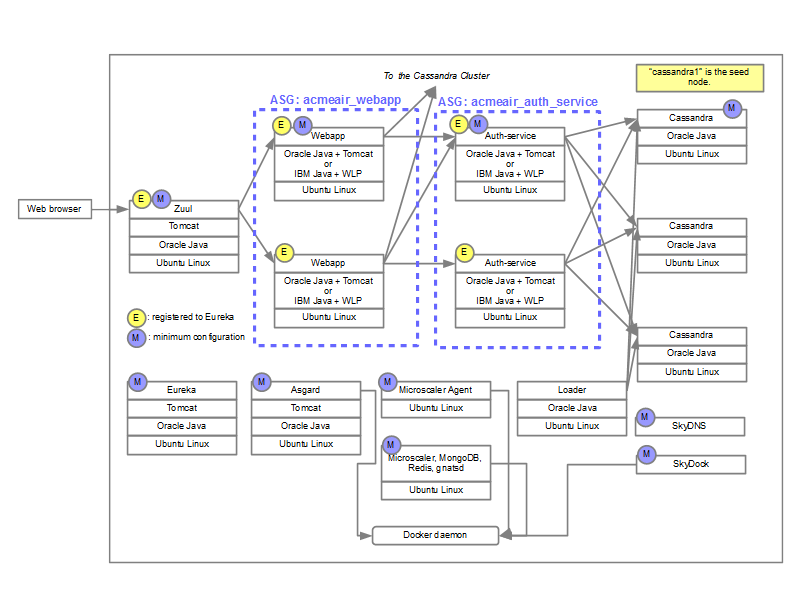

Acmeair-netflix-docker
======================
These instructions are based on Docker 1.0.0 run on Ubuntu trusty boot2docker. [(Japanese)](README_ja.md)

## The topology



## Configurations
### Enable remote API access of Docker daemon via TCP socket
Change Docker daemon startup configuration (`/etc/default/docker`) like as bellow. On boot2docker, it is enabled by default.

```bash
# Use DOCKER_OPTS to modify the daemon startup options.
#DOCKER_OPTS="-dns 8.8.8.8 -dns 8.8.4.4"
DOCKER_OPTS="-H tcp://0.0.0.0:2375 -H unix://var/run/docker.sock"
```

### Docker client command
If you need `sudo` with `docker` command, change `docker_cmd` in `bin/env.sh`.

```bash
docker_cmd="sudo docker"
```

### The bridge name which is used by Docker daemon
If your Docker daemon uses a bridge different from `docker0`, change `bridge_name` in `bin/env.sh`.

```bash
bridge_name=bridge0
```

## Build images
You have to agree the licenses before building the images and use them.

```bash
cd bin
./acceptlicenses.sh
./buildimages.sh
```

An SSH key pair is created in this process. That is `bin/id_rsa` and `bin/id_rsa.pub`. The private key is used for login to the instances via SSH. If you want to use another key pair, place it in `bin` directory as `id_rsa` and `id_rsa.pub`.

## Start the minimum set of containers
`startminimum.sh` starts the minimum set of containers. The script starts SkyDNS, SkyDock, one Cassandra (cassandra1), the data loader, Eureka server (service registry), Zuul (load balancer), Microscaler and Microscaler Agent. Two auto scaling groups (ASGs) are created. One is for the authentication service, another is for the web application. Each ASG has one instance as the desired capacity. The one auth-service and one webapp are started by Microscaler. Please wait few minutes after the command finishes.

```bash
cd bin
./startminimum.sh
```

## Switch the application servers
The default application server for auth-service and webbapp is IBM WebSphere Application Server Liberty profile (WLP). You can use Tomcat instead of WLP. Change `appserver` value in `bin/env.sh`.

```bash
# "wlp" for WAS Liberty profile or "tc" for Tomcat
appserver=tc
```

Delete and create the ASGs (and the loader configurations) to run auth-service and webapp on Tomcat.

```bash
cd bin
./deleteasg.sh
./configureasg.sh
./startasg.sh
```

## Add additional containers
Auth-service and webapp are managed by Microscaler. If you want more those instances, change ASG configuration.

### Cassandra

```bash
./addcassandra.sh
```

## Stop all containers and clean the environment

```bash
./stopall.sh
```

## Show IP Addresses of the containers

```bash
./showipaddrs.sh
```

## Login to the container
Use SSH. SSH servers run on all containers except SkyDNS and SkyDock.

```bash
ssh -i bin/id_rsa root@172.17.0.5
```

## Quick test
### Zuul and webapp

```bash
./testwebapp.sh
```

or

```bash
./testwebapp.sh 172.17.0.6
```

### auth-service

```bash
./testauth.sh
```

or

```bash
./testauth.sh 172.17.0.9
```

### Cassandra

```bash
./showcassandrastatus.sh

./showcustomertable.sh
```

## Check name resolution

```bash
dig @172.17.42.1 +short zuul.*.local.flyacmeair.net
dig @172.17.42.1 +short eureka.*.local.flyacmeair.net
dig @172.17.42.1 +short cassandra1.*.local.flyacmeair.net
dig @172.17.42.1 +short webapp1.*.local.flyacmeair.net
dig @172.17.42.1 +short auth1.*.local.flyacmeair.net
```

## Problem?
Make sure your docker version. The version might be different from the assumption of these instructions.

```bash
$ docker version
Client version: 1.0.0
Client API version: 1.12
Go version (client): go1.2.1
Git commit (client): 63fe64c
Server version: 1.0.0
Server API version: 1.12
Go version (server): go1.2.1
Git commit (server): 63fe64c
```

TCP socket might not be enabled. Check options of Docker daemon.

```bash
$ ps -ef | grep docker
root     22320     1  0 14:06 ?        00:01:00 /usr/bin/docker -d -H tcp://0.0.0.0:2735 -H unix://var/run/docker.sock
```

Your firewall might block the communications between the containers and the Docker daemon. Please check your firewall rules.

SkyDock might not work properly. Please try restart `skydock`. SkyDock registers all running containers at its start time. You don't have to restart other containers.

```bash
docker restart skydock
```

The Docker images might different as you assume. Try following commands to clear images. NOTICE: the following commands stop all containers and remove all containers and images.

```bash
docker rm -f `docker ps -qa`
docker rmi `docker images -q`
```

## Software versions
|Image|Name|Version|Format|Source|
|-----|----|------|------|-------|
|asgard|Asgard|latest (dockerlocal branch)|binary|https://acmeair.ci.cloudbees.com/job/asgard-etiport/|
|asgard|MongoDB|2.4.9|binary|Ubuntu repository|
|auth-service|NetflixOSS Acme Air|latest (astyanax branch)|binary|https://acmeair.ci.cloudbees.com/job/acmeair-netflix-astyanax/|
|base|Oracle Java|7|binary|https://launchpad.net/~webupd8team/+archive/java/|
|base|ruby|1.9.3|binary|Ubuntu repository|
|base|sshd|6.6|binary|Ubuntu repository|
|base|supervisor|3.0|binary|Ubuntu repository|
|base|Ubuntu Linux|14.04|binary|[Docker Index](https://index.docker.io/)|
|cassandra|Cassandra|2.0.7|binary|http://cassandra.apache.org/|
|eureka|Eureka server|1.1.132|binary|Maven Central Repository|
|ibmjava|IBM Java|7.0 SR5|binary|https://public.dhe.ibm.com/ibmdl/export/pub/software/websphere/wasdev/downloads/jre/index.yml|
|liberty|IBM WebSphere Application Server Liberty profile|8.5.5.2|binary|https://public.dhe.ibm.com/ibmdl/export/pub/software/websphere/wasdev/downloads/wlp/index.yml|
|loader|Acme Air loader|latest (astyanax branch)|binary|https://acmeair.ci.cloudbees.com/job/acmeair-netflix-astyanax/|
|microscaler|Microscaler CLI|latest|source|https://github.com/EmergingTechnologyInstitute/microscaler/|
|microscaler|Microscaler|latest|source|https://github.com/EmergingTechnologyInstitute/microscaler/|
|microscaler|gnatsd|latest|source|https://github.com/apcera/gnatsd/|
|microscaler|Go|1.2.1|binary|Ubuntu repository|
|microscaler|MongoDB|2.4.9|binary|Ubuntu repository|
|microscaler|Redis|2.8.4|binary|Ubuntu repository|
|microscaler-agent|Microscaler Agent|latest|source|https://github.com/EmergingTechnologyInstitute/microscaler/|
|skydns|SkyDNS|latest|binary|[Docker Index](https://index.docker.io/)|
|skydock|SkyDock|latest|binary|[Docker Index](https://index.docker.io/)|
|tomcat|Tomcat|7.0.54|binary|http://tomcat.apache.org/|
|webapp|Acme Air|latest (astyanax branch)|binary|https://acmeair.ci.cloudbees.com/job/acmeair-netflix-astyanax/|
|zuul|Zuul|1.0.21|binary|Maven Central Repository|
